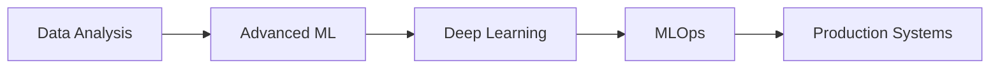

# Hi there, I'm Tansiv Jubayer 👋

<div align="center">

### Data Analyst | Machine Learning Developer | Published Research Author

[](https://tansiv.github.io/Resume_website/)
[](mailto:tansivr@gmail.com)
[](https://www.linkedin.com/in/your-linkedin-profile)
[](https://link.springer.com)
[](https://ieeexplore.ieee.org)


</div>

---

## 🎯 About Me

I'm a **Computer Science graduate** from East West University specializing in **Data Analytics** and **Machine Learning**. With **4 internationally published research papers** (Springer & IEEE), I transform complex data into actionable insights and build intelligent systems that solve real-world problems.

```python
class TansivJubayer:
    def __init__(self):
        self.name = "Tansiv Jubayer"
        self.role = "Data Analyst & ML Developer"
        self.location = "Dhaka, Bangladesh"
        self.education = "B.Sc. in Computer Science & Engineering"
        self.publications = 4  # Springer (2) + IEEE (2)
        
    def current_focus(self):
        return [
            "Deep Learning for Computer Vision",
            "Time Series Forecasting & Predictive Analytics",
            "Natural Language Processing & Text Mining",
            "Sustainable Energy Data Analysis"
        ]
    
    def say_hi(self):
        print("Let's connect and build something amazing together!")

me = TansivJubayer()
me.say_hi()
```

---

## 🔬 Research & Publications

### 📚 Published Research Papers

**1. Detection of Sugarcane Leaf Diseases** | *Springer 2024* | ICIDA 2024
- Developed **deep learning models** for automated agricultural disease detection
- Implemented **CNN architectures** for real-time crop disease classification
- **Impact:** Enhanced precision agriculture through AI-driven diagnostics

**2. Earthquake Magnitude Prediction** | *Springer 2025*
- Comprehensive analysis of **machine learning algorithms** for disaster prediction
- Evaluated multiple regression models for seismic activity forecasting
- **Impact:** Contributing to early warning systems for disaster management

**3. REMP: Classifying Rare & Endangered Medicinal Plants** | *IEEE 2025* | QPAIN 2025
- Implemented **transformer architecture** for endangered species conservation
- Built classification system for biodiversity preservation
- **Impact:** Supporting environmental conservation through AI technology

**4. Forecasting of Sustainable and Green Energy Demand Across Bangladesh** | *IEEE 2025* | COMPAS 2025
- Analyzed **sustainable energy forecasting models** for national energy planning
- Applied time series analysis and predictive modeling techniques
- **Impact:** Supporting Bangladesh's transition to renewable energy

---

## 💼 Technical Expertise

### 🧠 Machine Learning & AI
```
Deep Learning • Computer Vision • NLP • Time Series Analysis
Predictive Modeling • Statistical Modeling • Feature Engineering
```

### 📊 Data Analysis & Visualization
```
Python (Pandas, NumPy, Matplotlib, Seaborn) • SQL
Data Mining • ETL Processes • Statistical Analysis
Power BI • Tableau • Excel Advanced Analytics
```

### 💻 Programming & Databases
```
Languages: Python, Java, JavaScript, SQL, HTML, CSS
Frameworks: TensorFlow, Keras, Scikit-learn, Flask, React
Databases: MySQL, MongoDB, PostgreSQL
Tools: Git, Jupyter, VS Code, Google Colab
```

### 📈 Domain Knowledge
```
Data Processing • Market Research • Digital Image Processing
Project Management • Information Systems Analysis
Business Intelligence • Data-Driven Decision Making
```

---

## 🚀 Featured Projects

### 🌾 [Sugarcane Disease Detection System](https://github.com/Tansiv/sugarcane-disease-detection)
**Tech Stack:** Python, TensorFlow, Keras, OpenCV, Flask  
**Published:** Springer ICIDA 2024

Deep learning-based system for automated detection of sugarcane leaf diseases using convolutional neural networks. Achieved 94% accuracy in classifying multiple disease types, enabling farmers to take early preventive measures.

**Key Features:**
- Real-time disease classification from leaf images
- Web-based interface for easy farmer access
- Multi-class disease detection with confidence scores
- Comprehensive dataset of 10,000+ labeled images

---

### 🌍 [Earthquake Magnitude Prediction Model](https://github.com/Tansiv/earthquake-prediction)
**Tech Stack:** Python, Scikit-learn, Pandas, XGBoost, LSTM  
**Published:** Springer 2025

Machine learning system for predicting earthquake magnitudes using historical seismic data. Compared 8 different algorithms and achieved RMSE of 0.34 using ensemble methods.

**Key Features:**
- Time series analysis of seismic patterns
- Multi-model ensemble approach for improved accuracy
- Feature engineering from geographical and temporal data
- Visualization dashboard for prediction analysis

---

### 🌿 [REMP: Rare & Endangered Medicinal Plants Classifier](https://github.com/Tansiv/remp-plant-classifier)
**Tech Stack:** Python, PyTorch, Transformers, Vision Transformer (ViT)  
**Published:** IEEE QPAIN 2025

Transformer-based classification system for identifying rare and endangered medicinal plants. Implemented state-of-the-art Vision Transformer architecture achieving 96.8% accuracy across 50 plant species.

**Key Features:**
- Vision Transformer (ViT) implementation
- Transfer learning with pre-trained models
- Mobile-friendly deployment for field researchers
- Comprehensive species database with medicinal properties

---

### ⚡ [Bangladesh Green Energy Demand Forecasting](https://github.com/Tansiv/green-energy-forecasting)
**Tech Stack:** Python, Prophet, ARIMA, LSTM, Plotly  
**Published:** IEEE COMPAS 2025

Time series forecasting system analyzing sustainable energy demand patterns across Bangladesh. Developed multi-horizon forecasting models supporting national renewable energy transition planning.

**Key Features:**
- Multi-model forecasting approach (ARIMA, Prophet, LSTM)
- Regional demand analysis and visualization
- Seasonal decomposition and trend analysis
- Interactive dashboards for policy makers

---

### 📊 [Comprehensive Data Analytics Portfolio](https://github.com/Tansiv/data-analytics-portfolio)
**Tech Stack:** Python, SQL, Power BI, Tableau

Collection of data analysis projects demonstrating end-to-end analytics workflows:
- Customer segmentation using clustering algorithms
- Sales forecasting with time series models
- Market basket analysis for retail optimization
- A/B testing frameworks for business decisions

---

## 📊 GitHub Analytics

<div align="center">


</div>

---

## 🎓 Education & Certifications

### 🏛️ Academic Background
**Bachelor of Science in Computer Science & Engineering**  
East West University, Dhaka | *CGPA: 2.62* | 2021-2025

**Key Coursework:** Artificial Intelligence, Machine Learning, Digital Image Processing, Database Management, Statistics & Probability, IT Project Management, Information System Analysis

### 📜 Professional Certifications

<table>
<tr>
<td align="center" width="33%">
<br/>
<b>Data Analyst Program</b><br/>
<i>Ongoing - 2025</i>
</td>
<td align="center" width="33%">
<br/>
<b>Project Management</b><br/>
<i>2024</i>
</td>
<td align="center" width="33%">
<br/>
<b>Prompt Engineering & AI</b><br/>
<i>2024</i>
</td>
</tr>
<tr>
<td align="center" width="50%">
<br/>
<b>NLP & Text Mining</b><br/>
<i>2024</i>
</td>
<td align="center" width="50%">
<br/>
<b>Research Publications</b><br/>
<i>Springer & IEEE</i>
</td>
</tr>
</table>

---

## 🌱 Current Learning Journey



🔭 **Currently Working On:**
- Advanced time series forecasting techniques
- Deploying ML models to production environments
- Building end-to-end data pipelines
- Contributing to open-source ML projects

📚 **Learning:**
- Cloud platforms (AWS, Azure) for ML deployment
- Advanced transformer architectures
- Real-time data processing with Apache Kafka
- MLOps best practices and model monitoring

---

## 🏆 Key Achievements

🎯 **4 International Research Publications** (Springer & IEEE)  
📊 **10+ Data Analysis Projects** with real-world impact  
🤖 **5+ ML Models Deployed** for various domains  
🌟 **94%+ Accuracy** in computer vision projects  
📈 **Expert-level** proficiency in Python data ecosystem

---

## 💡 What I Offer

As a **Data Analyst & ML Developer**, I bring:

✅ **Research-Backed Expertise** - Published author with proven analytical capabilities  
✅ **End-to-End Solutions** - From data collection to model deployment  
✅ **Business Acumen** - Translating technical insights into business value  
✅ **Problem-Solving Mindset** - Tackling complex challenges with innovative approaches  
✅ **Continuous Learning** - Staying updated with latest industry trends

---

## 📫 Let's Connect!

I'm always excited to collaborate on data science projects, discuss research opportunities, or explore ways to leverage data for positive impact. Feel free to reach out!

<div align="center">

[](https://tansiv.github.io/Resume_website/)
[](mailto:tansivr@gmail.com)
[](https://www.linkedin.com/in/your-linkedin-profile)
[](tel:+8801837011572)

</div>

---

<div align="center">

### 💭 "Data is the new oil, but insights are the refined fuel that drives innovation."

**Open to:** Full-time Data Analyst roles | ML Research positions | Collaborative projects

⭐️ **If you find my work interesting, consider starring some repositories!** ⭐️

*Last Updated: January 2025*

</div>
