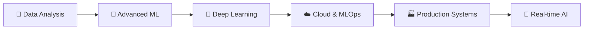

<div align="center">


[](https://git.io/typing-svg)

<p align="center">
  
  
  
  
</p>

</div>

---

## 🪪 About Me

```yaml
Name        : Tansiv Jubayer
Role        : Data Analyst | AI Engineer | Machine Learning Engineer
Location    : Khilgaon, Dhaka, Bangladesh
Email       : jtansiv@gmail.com
Phone       : +880 1837011572
Experience  : 2+ Years (Research & Projects)
Publications: 4 (IEEE × 2 | Springer × 2)
Status      : Open to Opportunities ✅
```

<div align="center">

[](https://tansiv.github.io/Tansiv_Jubayer_portfolio-website/)
[](https://www.linkedin.com/in/tansiv-jubayer/)
[](https://github.com/Tansiv)
[](mailto:jtansiv@gmail.com)
[](https://ieeexplore.ieee.org)
[](https://link.springer.com)

</div>

---

## 🎯 Professional Summary

> Data Analyst and aspiring AI/ML Engineer with 2+ years of research and project experience spanning predictive modeling, deep learning, and business-facing data analytics. Skilled in turning raw datasets into decision-ready insights using **Python, SQL, Excel, and Power BI**, alongside hands-on experience building end-to-end machine learning and deep learning pipelines. Co-author of 4 IEEE and Springer publications. Comfortable operating across the full analytics-to-AI stack — from data cleaning and dashboarding to model training and deployment.

---

## 🎓 Education

<table width="100%">
<thead>
<tr>
<th>🏛️ Degree</th>
<th>🏫 Institution</th>
<th>📅 Year</th>
<th>📊 GPA / CGPA</th>
</tr>
</thead>
<tbody>
<tr>
<td><b>BSc in Computer Science & Engineering</b></td>
<td>East West University, Dhaka</td>
<td>2025</td>
<td><code>2.66 / 4.00</code></td>
</tr>
<tr>
<td><b>Higher Secondary Certificate (HSC)</b></td>
<td>Ideal College, Dhanmondi</td>
<td>2020</td>
<td><code>4.50 / 5.00</code></td>
</tr>
<tr>
<td><b>Secondary School Certificate (SSC)</b></td>
<td>Motijheel Model School and College</td>
<td>2018</td>
<td><code>4.50 / 5.00</code></td>
</tr>
</tbody>
</table>

---

## 🔬 Research & Publications

> 📌 **4 Internationally Peer-Reviewed Papers** | IEEE (×2) + Springer (×2)

<details open>
<summary><b>⚡ 01 — Forecasting of Sustainable & Green Energy Demand Across Bangladesh</b></summary>
<br/>

**Published:** IEEE COMPAS 2025 &nbsp;|&nbsp; [](https://ieeexplore.ieee.org/abstract/document/11381781)

Built an end-to-end time-series energy demand forecasting pipeline using **LSTM** and **XGBoost** on 10,000+ records, improving prediction accuracy by **15%** through advanced time-based feature engineering.

`Time Series` `LSTM` `XGBoost` `Energy Analytics` `Feature Engineering`

</details>

<details open>
<summary><b>🌾 02 — Detection of Sugarcane Leaf Diseases Using Deep Learning</b></summary>
<br/>

**Published:** Springer ICIDA 2024 &nbsp;|&nbsp; [](https://link.springer.com/chapter/10.1007/978-981-96-6303-3_20)

Trained a **ResNet50-based CNN** on 5,000+ agricultural images using transfer learning, achieving **92% accuracy** and improving robustness by **30%** through data augmentation and hyperparameter tuning.

`CNN` `ResNet50` `Transfer Learning` `Computer Vision` `Agriculture AI`

</details>

<details open>
<summary><b>🌍 03 — Earthquake Magnitude Prediction Using Machine Learning</b></summary>
<br/>

**Published:** Springer 2025 &nbsp;|&nbsp; [](https://link.springer.com/chapter/10.1007/978-981-96-6303-3_42)

Conducted comparative analysis of ML models for time-series seismic prediction, improving reliability through feature engineering and evaluation using **RMSE/MAE** metrics. Contributed to research design and methodology.

`Seismic Forecasting` `ML Comparison` `RMSE/MAE` `Disaster AI` `Feature Engineering`

</details>

<details open>
<summary><b>🌿 04 — REMP: Classifying Rare & Endangered Medicinal Plants</b></summary>
<br/>

**Published:** IEEE QPAIN 2025 &nbsp;|&nbsp; [](https://ieeexplore.ieee.org/abstract/document/11171802)

Implemented a **Swin Transformer**-based image classification model on high-resolution plant datasets, improving precision by **10–12%** over CNN baselines through attention mechanisms and optimized PyTorch training pipelines.

`Swin Transformer` `Vision AI` `PyTorch` `Conservation` `Biodiversity`

</details>

---

## 🛠️ Technical Skills Dashboard

<div align="center">

### Languages & Frameworks


### ML / DL Frameworks


### Data Analytics & Visualization


### Databases & Tools


</div>

---

### 🧠 Skill Competency Matrix

| Domain | Skills | Level |
|---|---|---|
| **Data Analysis** | Pandas, NumPy, EDA, Statistics | `█████████░` Advanced |
| **Data Visualization** | Power BI, Excel, Plotly, Seaborn, Tableau | `████████░░` Advanced |
| **SQL & Databases** | MySQL, PostgreSQL, SQL Server | `████████░░` Advanced |
| **Programming** | Python, SQL, Java, JavaScript, PHP | `████████░░` Advanced |
| **Machine Learning** | Scikit-learn, XGBoost, Feature Engineering | `████████░░` Advanced |
| **Deep Learning** | CNN, LSTM, Transformers, ViT, Swin | `███████░░░` Proficient |
| **NLP** | Text Mining, BERT, Embeddings | `██████░░░░` Intermediate |
| **Data Engineering** | ETL Pipelines, SQL Optimization | `███████░░░` Proficient |

---

### 🤝 Professional Skills

<table width="100%">
<tr>
<td width="50%">

✅ Research & Academic Writing
✅ Critical Thinking & Problem Solving
✅ Technical Documentation
✅ Data-Driven Decision Making

</td>
<td width="50%">

✅ Cross-functional Collaboration
✅ Analytical Thinking
✅ Project Management
✅ Presentation & Communication

</td>
</tr>
</table>

**Languages:** English `Fluent` &nbsp;|&nbsp; Bengali `Native`

---

## 🚀 Featured Projects

<div align="center">
<table>
<tr>
<td width="50%" valign="top">

### ⚡ Green Energy Demand Forecasting
[](https://ieeexplore.ieee.org/abstract/document/11381781)

Multi-horizon time-series forecasting using **LSTM** and **XGBoost** on 10,000+ records, with feature engineering that improved prediction accuracy by 15%.

`Python` `LSTM` `XGBoost` `Time Series`

</td>
<td width="50%" valign="top">

### 🌾 Sugarcane Disease Detection
[](https://link.springer.com/chapter/10.1007/978-981-96-6303-3_20)

**ResNet50**-based CNN achieving 92% accuracy on 5,000+ agricultural images via transfer learning and data augmentation.

`TensorFlow` `ResNet50` `Computer Vision`

</td>
</tr>
<tr>
<td width="50%" valign="top">

### 🌍 Earthquake Magnitude Prediction
[](https://link.springer.com/chapter/10.1007/978-981-96-6303-3_42)

Comparative benchmarking of ML models for seismic magnitude prediction, evaluated using RMSE/MAE.

`Scikit-learn` `XGBoost` `LSTM` `Pandas`

</td>
<td width="50%" valign="top">

### 🌿 REMP: Medicinal Plant Classifier
[](https://ieeexplore.ieee.org/abstract/document/11171802)

**Swin Transformer** image classifier improving precision 10–12% over CNN baselines through attention mechanisms.

`PyTorch` `Swin Transformer` `ViT`

</td>
</tr>
</table>
</div>

---

## 📂 Data Analytics Projects

<table width="100%">
<tr>
<td width="50%" valign="top">

### 📊 [IRC Intelligence Dashboard](https://github.com/Tansiv/IRC-intelligence-dashboard)
RFM customer segmentation, seasonal sales trend analysis, and delivery-risk analytics built with **Excel** and **Power BI**.

`Excel` `Power BI` `RFM Analysis` `Business Intelligence`

</td>
<td width="50%" valign="top">

### 🌐 [Global Food Price Project](https://github.com/Tansiv/GlobalFoodPriceProject)
Analysis of global food price stability and inflation trends to surface data-driven economic insights.

`Python` `Pandas` `Data Analysis` `Economics`

</td>
</tr>
<tr>
<td width="50%" valign="top">

### 🗃️ [Advanced SQL Sales Analytics](https://github.com/Tansiv/Advanced-SQL-Sales-Analytics)
Retail sales analytics built with **SQL Server**, covering advanced querying, aggregation, and reporting logic.

`SQL Server` `T-SQL` `Retail Analytics`

</td>
<td width="50%" valign="top">

### 📈 [Power BI Assignment](https://github.com/Tansiv/Power-BI-Assignment)
Power BI dashboarding assignment focused on data modeling and interactive report design.

`Power BI` `Data Modeling` `Dashboarding`

</td>
</tr>
<tr>
<td width="50%" valign="top">

### 🧾 [OIBSIP](https://github.com/Tansiv/OIBSIP)
Collection of Data Analytics internship projects covering exploratory analysis and reporting tasks.

`Python` `Data Analytics` `Internship Projects`

</td>
<td width="50%" valign="top">

</td>
</tr>
</table>

---

## 💻 Software & Web Projects

<table width="100%">
<tr>
<td width="50%" valign="top">

### ✅ [Task Manager](https://github.com/Tansiv/task-manager)
JavaScript-based task management application.

`JavaScript`

</td>
<td width="50%" valign="top">

### 🔐 [RBAC Project](https://github.com/Tansiv/rbac_project)
Role-Based Access Control system built in **PHP**.

`PHP` `RBAC` `Authentication`

</td>
</tr>
<tr>
<td width="50%" valign="top">

### 🎮 [FunQuiz3D](https://github.com/Tansiv/FunQuiz3D)
Interactive, animated JavaScript quiz website with engaging UI interactions.

`JavaScript` `HTML` `CSS`

</td>
<td width="50%" valign="top">

### 💌 [Be My Valentine](https://github.com/Tansiv/be_my_Valentine)
A themed interactive web mini-project.

`JavaScript` `HTML` `CSS`

</td>
</tr>
<tr>
<td width="50%" valign="top">

### 🐍 [Python Roadmap](https://github.com/Tansiv/Python_roadmap)
Structured roadmap and resources for learning Python.

`Python` `Learning Resources`

</td>
<td width="50%" valign="top">

### ⚙️ [Tansiv](https://github.com/Tansiv/Tansiv)
GitHub profile configuration repository powering this README.

`GitHub Actions` `Markdown`

</td>
</tr>
</table>

---

## 📊 GitHub Analytics

<div align="center">


&nbsp;&nbsp;


<br/><br/>


<br/><br/>


<br/><br/>


<br/><br/>


<br/>


</div>

<div align="center">


&nbsp;

&nbsp;


</div>

---

## 🏆 GitHub Trophies

<div align="center">

</div>

---

## 🏅 Key Achievements

<div align="center">

| 🏆 Milestone | 📌 Detail |
|---|---|
| 📝 International Publications | 4 Papers — IEEE (×2) + Springer (×2) |
| 🎯 Model Accuracy | 96.8% — Swin Transformer (Plant Classification) |
| 🌾 Computer Vision | 92% accuracy on 5,000+ agricultural images |
| ⚡ Forecasting Gain | +15% accuracy via time-based feature engineering |
| 📊 Dataset Scale | Worked on datasets up to 10,000+ records |
| 🤖 Models Deployed | 5+ end-to-end ML models across domains |

</div>

---

## 👨‍🏫 References

<table width="100%">
<tr>
<td width="33%" align="center" valign="top">

**Dr. Ahmed Wasif Reza**
Professor, Dept. of CSE
Dean, Faculty of Sciences & Engineering
East West University
📧 [wasif@ewubd.edu](mailto:wasif@ewubd.edu)

</td>
<td width="33%" align="center" valign="top">

**Dr. Maheen Islam**
Chairperson & Associate Professor
Dept. of Computer Science & Engineering
East West University
📧 [maheen@ewubd.edu](mailto:maheen@ewubd.edu)

</td>
<td width="33%" align="center" valign="top">

**Dr. Raihan Ul Islam**
Associate Professor
Dept. of Computer Science & Engineering
East West University
📧 [raihan.islam@ewubd.edu](mailto:raihan.islam@ewubd.edu)

</td>
</tr>
</table>

---

## 🌱 Current Focus & Learning Roadmap


```mermaid
graph LR
    A[🧮 Data Analysis] --> B[🤖 Advanced ML]
    B --> C[🧠 Deep Learning]
    C --> D[☁️ Cloud & MLOps]
    D --> E[🏭 Production Systems]
    E --> F[🔄 Real-time AI]
```

**🔭 Currently Working On:**
- Advanced transformer architectures for vision and NLP
- End-to-end data pipelines and MLOps workflows
- Cloud deployment on AWS / Azure for ML models
- Real-time processing with Apache Kafka

---

<div align="center">


### 💬 *"Data is the new oil — but insights are the refined fuel that drives innovation."*

**Open to:** Data Analyst Roles &nbsp;|&nbsp; AI/ML Engineer Roles &nbsp;|&nbsp; Collaborative Projects

[](https://tansiv.github.io/Tansiv_Jubayer_portfolio-website/)
[](mailto:jtansiv@gmail.com)
[](https://www.linkedin.com/in/tansiv-jubayer/)
[](tel:+8801837011572)

⭐️ *If you find my work valuable, consider starring the repositories!* ⭐️

*Last Updated: August 2026*

</div>
