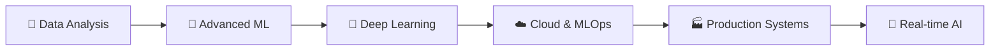

<div align="center">

<!-- Animated Header Banner -->


<!-- Typing Animation -->
[](https://git.io/typing-svg)

<!-- Coding GIF banner -->


<!-- Profile Metrics -->
<p align="center">
  
  
  
  
</p>

</div>

---

## 🪪 **IDENTIFICATION**

<table width="100%">
<tr>
<td width="60%" valign="top">

```yaml
Name        : Tansiv Jubayer
Role        : Data Analyst & ML Developer
Location    : Khilgaon, Dhaka, Bangladesh
Email       : jtansiv@gmail.com
Phone       : +880 1837011572
Experience  : 2+ Years (Research & Projects)
Publications: 4 (IEEE × 2 | Springer × 2)
Status      : Open to Opportunities ✅
```

</td>
<td width="40%" align="center" valign="top">

### 🔗 Connect With Me

[](https://tansiv.github.io/Tansiv_Jubayer_portfolio-website/)
[](https://www.linkedin.com/in/tansiv-jubayer/)
[](https://github.com/Tansiv)
[](mailto:jtansiv@gmail.com)
[](https://ieeexplore.ieee.org)
[](https://link.springer.com)

</td>
</tr>
</table>

---

## 🎯 Professional Summary

<div align="center">
<blockquote>
<i>"Data Science and Machine Learning professional with 2+ years of research and project experience in predictive modeling, deep learning, and data analytics. Proven expertise in building end-to-end ML pipelines, analyzing large datasets, and deploying high-performance models. Co-author of 4 IEEE and Springer publications. Skilled across Data Science, Data Analysis, Data Engineering, Business Intelligence, and full end-to-end AI development workflows."</i>
</blockquote>
</div>

---

## 🎓 Education

<table width="100%">
<thead>
<tr>
<th>🏛️ Degree</th>
<th>🏫 Institution</th>
<th>📅 Year</th>
<th>📊 GPA / CGPA</th>
</tr>
</thead>
<tbody>
<tr>
<td><b>BSc in Computer Science & Engineering</b></td>
<td>East West University, Dhaka</td>
<td>2025</td>
<td><code>2.66 / 4.00</code></td>
</tr>
<tr>
<td><b>Higher Secondary Certificate (HSC)</b></td>
<td>Ideal College, Dhanmondi</td>
<td>2020</td>
<td><code>4.50 / 5.00</code></td>
</tr>
<tr>
<td><b>Secondary School Certificate (SSC)</b></td>
<td>Motijheel Model School and College</td>
<td>2018</td>
<td><code>4.50 / 5.00</code></td>
</tr>
</tbody>
</table>

---

## 🔬 Research & Publications

> 📌 **4 Internationally Peer-Reviewed Papers** | IEEE (×2) + Springer (×2)

<details open>
<summary><b>⚡ 01 — Forecasting of Sustainable & Green Energy Demand Across Bangladesh</b></summary>
<br/>

**Published:** IEEE COMPAS 2025 &nbsp;|&nbsp; [](https://ieeexplore.ieee.org/abstract/document/11381781)

Built an end-to-end time-series energy demand forecasting pipeline using **LSTM** and **XGBoost** on 10,000+ records, improving prediction accuracy by **15%** through advanced time-based feature engineering.

`Time Series` `LSTM` `XGBoost` `Energy Analytics` `Feature Engineering`

</details>

<details open>
<summary><b>🌾 02 — Detection of Sugarcane Leaf Diseases Using Deep Learning</b></summary>
<br/>

**Published:** Springer ICIDA 2024 &nbsp;|&nbsp; [](https://link.springer.com/chapter/10.1007/978-981-96-6303-3_20)

Trained a **ResNet50-based CNN** on 5,000+ agricultural images using transfer learning, achieving **92% accuracy** and improving robustness by **30%** through data augmentation and hyperparameter tuning.

`CNN` `ResNet50` `Transfer Learning` `Computer Vision` `Agriculture AI`

</details>

<details open>
<summary><b>🌍 03 — Earthquake Magnitude Prediction Using Machine Learning</b></summary>
<br/>

**Published:** Springer 2025 &nbsp;|&nbsp; [](https://link.springer.com/chapter/10.1007/978-981-96-6303-3_42)

Conducted comparative analysis of ML models for time-series seismic prediction, improving reliability through feature engineering and evaluation using **RMSE/MAE** metrics. Contributed to research design and methodology.

`Seismic Forecasting` `ML Comparison` `RMSE/MAE` `Disaster AI` `Feature Engineering`

</details>

<details open>
<summary><b>🌿 04 — REMP: Classifying Rare & Endangered Medicinal Plants</b></summary>
<br/>

**Published:** IEEE QPAIN 2025 &nbsp;|&nbsp; [](https://ieeexplore.ieee.org/abstract/document/11171802)

Implemented a **Swin Transformer**-based image classification model on high-resolution plant datasets, improving precision by **10–12%** over CNN baselines through attention mechanisms and optimized PyTorch training pipelines.

`Swin Transformer` `Vision AI` `PyTorch` `Conservation` `Biodiversity`

</details>

---

## 🛠️ Technical Skills Dashboard

<div align="center">

### Languages & Frameworks


### ML / DL Frameworks


### Data, BI & Visualization


### Databases & Tools


</div>

---

### 🧠 Skill Competency Matrix

| Domain | Skills | Level |
|---|---|---|
| **Programming** | Python, SQL, Java, JavaScript, PHP | `████████░░` Advanced |
| **Machine Learning** | Scikit-learn, XGBoost, Feature Engineering | `████████░░` Advanced |
| **Deep Learning** | CNN, LSTM, Transformers, ViT, Swin | `███████░░░` Proficient |
| **Data Analysis** | Pandas, NumPy, EDA, Statistics | `█████████░` Advanced |
| **Business Intelligence** | Power BI, Excel, RFM Segmentation, Dashboards | `████████░░` Advanced |
| **Visualization** | Plotly, Seaborn, Power BI, Tableau | `████████░░` Advanced |
| **NLP** | Text Mining, BERT, Embeddings | `██████░░░░` Intermediate |
| **Data Engineering** | ETL Pipelines, SQL Optimization | `███████░░░` Proficient |
| **Web / Application Dev** | JavaScript, PHP (RBAC), REST APIs | `██████░░░░` Intermediate |

---

### 🤝 Professional Skills

<table width="100%">
<tr>
<td width="50%">

✅ Research & Academic Writing
✅ Critical Thinking & Problem Solving
✅ Technical Documentation
✅ Data-Driven Decision Making

</td>
<td width="50%">

✅ Cross-functional Collaboration
✅ Analytical Thinking
✅ Project Management
✅ Presentation & Communication

</td>
</tr>
</table>

**Languages:** English `Fluent` &nbsp;|&nbsp; Bengali `Native`

---

## 📊 GitHub Analytics

<div align="center">

<!-- Core stats + top languages side by side -->

&nbsp;&nbsp;


<br/><br/>

<!-- Streak stats (herokuapp.com is deprecated/dead — moved to demolab.com) -->


<br/><br/>

<!-- Profile summary cards: rank/details on the left, commit/PR/issue/star breakdown on the right -->


<br/><br/>

<!-- Language usage as a pie chart -->


<br/><br/>

<!-- Weekly/monthly activity graph -->


<br/>

<!-- Animated snake contribution graph (auto-generated by GitHub Actions, see setup note below) -->


</div>

<div align="center">


&nbsp;

&nbsp;


</div>

---

## 🏆 GitHub Trophies

<div align="center">

</div>

---

## 🚀 Featured Research Projects

<div align="center">

<table>
<tr>
<td width="50%" valign="top">

### ⚡ Green Energy Demand Forecasting
[](https://github.com/Tansiv/green-energy-forecasting)
[](https://ieeexplore.ieee.org/abstract/document/11381781)

Multi-horizon forecasting with ARIMA, Prophet, and LSTM for national renewable energy planning. Built interactive dashboards for policy makers with seasonal decomposition analysis.

`Python` `LSTM` `XGBoost` `Prophet` `Plotly`

</td>
<td width="50%" valign="top">

### 🌾 Sugarcane Disease Detection
[](https://github.com/Tansiv/sugarcane-disease-detection)
[](https://link.springer.com/chapter/10.1007/978-981-96-6303-3_20)

ResNet50-based CNN achieving 92% accuracy on 5,000+ images. Real-time web interface for field use with confidence scoring and multi-class disease classification.

`TensorFlow` `ResNet50` `OpenCV` `Flask`

</td>
</tr>
<tr>
<td width="50%" valign="top">

### 🌍 Earthquake Magnitude Prediction
[](https://github.com/Tansiv/earthquake-prediction)
[](https://link.springer.com/chapter/10.1007/978-981-96-6303-3_42)

Benchmarked 8 ML algorithms for seismic prediction. Ensemble methods achieved RMSE of 0.34. Full visualization dashboard for magnitude analysis.

`Scikit-learn` `XGBoost` `LSTM` `Pandas`

</td>
<td width="50%" valign="top">

### 🌿 REMP: Medicinal Plant Classifier
[](https://github.com/Tansiv/remp-plant-classifier)
[](https://ieeexplore.ieee.org/abstract/document/11171802)

Swin Transformer model achieving 96.8% accuracy across 50 plant species. 10–12% precision boost over CNN baselines. Mobile-optimized for field researchers.

`PyTorch` `Swin Transformer` `ViT` `Transfer Learning`

</td>
</tr>
</table>

</div>

---

## 📂 Additional Repositories & Applied Projects

> Beyond published research, these repositories reflect hands-on work spanning **data analytics, BI dashboards, SQL engineering, and full-stack development.**

<table width="100%">
<thead>
<tr>
<th align="left">Repository</th>
<th align="left">Description</th>
<th align="center">Stack</th>
<th align="center">Stars</th>
<th align="center">Updated</th>
</tr>
</thead>
<tbody>

<tr>
<td><a href="https://github.com/Tansiv/IRC-intelligence-dashboard"><b>IRC Intelligence Dashboard</b></a></td>
<td>End-to-end RFM segmentation, seasonal sales trend, and delivery-risk analytics dashboard built on Indian fashion retail transaction data.</td>
<td align="center">Excel · Power BI</td>
<td align="center">⭐ —</td>
<td align="center">Jul 18, 2026</td>
</tr>

<tr>
<td><a href="https://github.com/Tansiv/Advanced-SQL-Sales-Analytics"><b>Advanced SQL Sales Analytics</b></a></td>
<td>Advanced SQL Server project demonstrating joins, subqueries, aggregation, and dashboard-ready analytics on a synthetic retail sales database.</td>
<td align="center">T-SQL</td>
<td align="center">⭐ —</td>
<td align="center">May 19, 2026</td>
</tr>

<tr>
<td><a href="https://github.com/Tansiv/rbac_project"><b>RBAC Project</b></a></td>
<td>Role-Based Access Control system implementing secure, permission-tiered authentication and authorization workflows.</td>
<td align="center">PHP</td>
<td align="center">⭐ 1</td>
<td align="center">Jun 9, 2026</td>
</tr>

<tr>
<td><a href="https://github.com/Tansiv/task-manager"><b>Task Manager</b></a></td>
<td>A lightweight task management web application for creating, tracking, and organizing daily tasks.</td>
<td align="center">JavaScript</td>
<td align="center">⭐ 1</td>
<td align="center">Jun 30, 2026</td>
</tr>

<tr>
<td><a href="https://github.com/Tansiv/Power-BI-Assignment"><b>Power BI Assignment</b></a></td>
<td>Applied Power BI coursework covering data modeling, DAX measures, and interactive report design.</td>
<td align="center">Power BI</td>
<td align="center">⭐ —</td>
<td align="center">Jun 30, 2026</td>
</tr>

<tr>
<td><a href="https://github.com/Tansiv/OIBSIP"><b>OIBSIP</b></a></td>
<td>Data science internship project set covering exploratory analysis, preprocessing, and predictive modeling exercises.</td>
<td align="center">Jupyter Notebook</td>
<td align="center">⭐ 1</td>
<td align="center">1 hour ago</td>
</tr>

<tr>
<td><a href="https://github.com/Tansiv/GlobalFoodPriceProject"><b>Global Food Price Project</b></a></td>
<td>Global food price stability and inflation analysis exploring macro trends across regions and commodities.</td>
<td align="center">HTML</td>
<td align="center">⭐ —</td>
<td align="center">Jan 8, 2026</td>
</tr>

<tr>
<td><a href="https://github.com/Tansiv/Python_roadmap"><b>Python Roadmap</b></a></td>
<td>Structured personal roadmap and exercise set for progressive mastery of Python fundamentals through advanced topics.</td>
<td align="center">Python</td>
<td align="center">⭐ —</td>
<td align="center">May 12, 2026</td>
</tr>

<tr>
<td><a href="https://github.com/Tansiv/FunQuiz3D"><b>FunQuiz3D</b></a></td>
<td>Interactive, animated trivia quiz website combining 3D effects and motion animations for an engaging user experience.</td>
<td align="center">JavaScript</td>
<td align="center">⭐ —</td>
<td align="center">Jan 14, 2026</td>
</tr>

<tr>
<td><a href="https://github.com/Tansiv/be_my_Valentine"><b>Be My Valentine</b></a></td>
<td>A playful, animated front-end mini-project built with custom CSS interactions.</td>
<td align="center">CSS</td>
<td align="center">⭐ —</td>
<td align="center">Feb 13, 2026</td>
</tr>

</tbody>
</table>

---

## 🏅 Key Achievements

<div align="center">

| 🏆 Milestone | 📌 Detail |
|---|---|
| 📝 International Publications | 4 Papers — IEEE (×2) + Springer (×2) |
| 🎯 Model Accuracy | 96.8% — Swin Transformer (Plant Classification) |
| 🌾 Computer Vision | 92% accuracy on 5,000+ agricultural images |
| ⚡ Forecasting Gain | +15% accuracy via time-based feature engineering |
| 📊 Dataset Scale | Worked on datasets up to 10,000+ records |
| 🤖 Models Deployed | 5+ end-to-end ML models across domains |
| 📈 BI & Analytics | RFM segmentation & delivery-risk dashboards for retail intelligence |
| 🗄️ Data Engineering | Advanced SQL Server analytics with joins, subqueries & aggregations |
| 🔐 Full-Stack Delivery | RBAC authentication system & JavaScript-based task manager |

</div>

---

## 👨‍🏫 References

<table width="100%">
<tr>
<td width="33%" align="center" valign="top">

**Dr. Ahmed Wasif Reza**
Professor, Dept. of CSE
Dean, Faculty of Sciences & Engineering
East West University
📧 [wasif@ewubd.edu](mailto:wasif@ewubd.edu)

</td>
<td width="33%" align="center" valign="top">

**Dr. Maheen Islam**
Chairperson & Associate Professor
Dept. of Computer Science & Engineering
East West University
📧 [maheen@ewubd.edu](mailto:maheen@ewubd.edu)

</td>
<td width="33%" align="center" valign="top">

**Dr. Raihan Ul Islam**
Associate Professor
Dept. of Computer Science & Engineering
East West University
📧 [raihan.islam@ewubd.edu](mailto:raihan.islam@ewubd.edu)

</td>
</tr>
</table>

---

## 🌱 Current Learning Roadmap


```mermaid
graph LR
    A[🧮 Data Analysis] --> B[🤖 Advanced ML]
    B --> C[🧠 Deep Learning]
    C --> D[☁️ Cloud & MLOps]
    D --> E[🏭 Production Systems]
    E --> F[🔄 Real-time AI]
```

**🔭 Currently Working On:**
- Advanced transformer architectures for vision and NLP
- End-to-end data pipelines and MLOps workflows
- Cloud deployment on AWS / Azure for ML models
- Real-time processing with Apache Kafka
- Expanding BI/analytics portfolio with advanced SQL and Power BI dashboards

---

<div align="center">

<!-- Footer Wave -->


### 💬 *"Data is the new oil — but insights are the refined fuel that drives innovation."*

**Open to:** Full-time Data Analyst Roles &nbsp;|&nbsp; ML Research Positions &nbsp;|&nbsp; Collaborative Projects

[](https://tansiv.github.io/Tansiv_Jubayer_portfolio-website/)
[](mailto:jtansiv@gmail.com)
[](https://www.linkedin.com/in/tansiv-jubayer/)
[](tel:+8801837011572)

⭐️ *If you find my work valuable, consider starring the repositories!* ⭐️

*Last Updated: August 2026*

</div>
